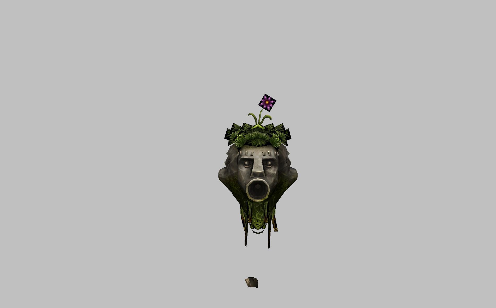
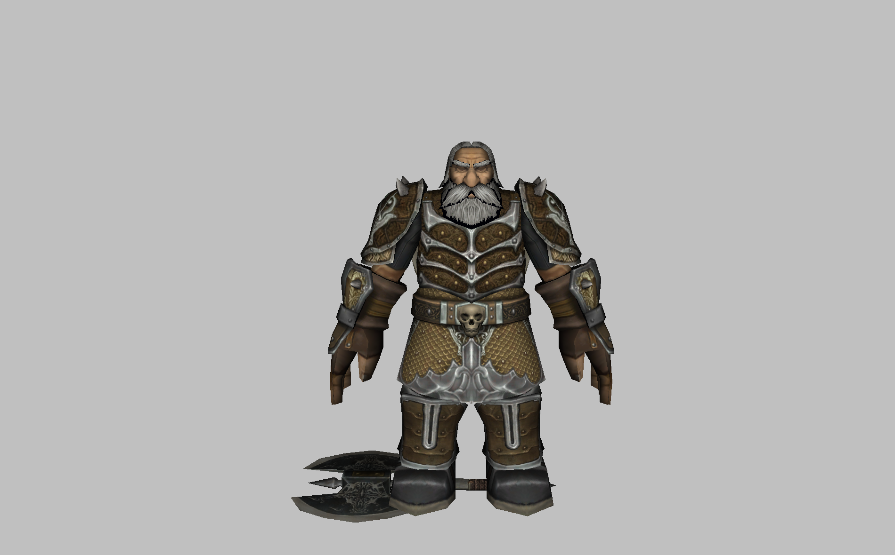
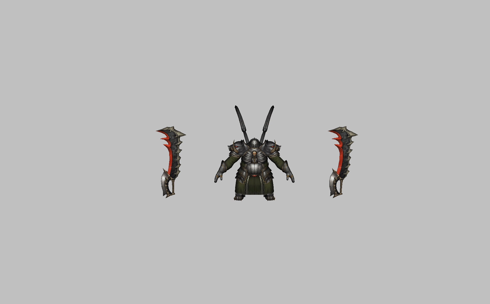

# Разные NPC созданные мной
### Всякие NPC, которых я делал. Тестовые :)

## Название папки: [Глашатай](Глашатай/)
- Название файла: m10064.png
- Просмотр файла:
# 

## Название папки: [Гном](Гном/)
- Название файла: m00026.png
- Просмотр файла:
# 

## Название папки: [Гремлин Кожевник](Гремлин%20Кожевник/)
- Название файла: m00019.png
- Просмотр файла:
# 

## Название папки: [Каменноликий Караульный](Каменноликий%20Караульный/)
- Название файла: m00820.png
- Просмотр файла:
# 

## Название папки: [КаменноликийnБерсерк](КаменноликийnБерсерк/)
- Название файла: m00818.png
- Просмотр файла:
# 

## Название папки: [КаменноликийnВерховный колдун](КаменноликийnВерховный%20колдун/)
- Название файла: m00817.png
- Просмотр файла:
# 

## Название папки: [КаменноликийnВоеначальник](КаменноликийnВоеначальник/)
- Название файла: m00819.png
- Просмотр файла:
# 

## Название папки: [Возможно стражница](Неопонанные/Возможно%20стражница/)
- Название файла: m00014.png
- Просмотр файла:
# 

## Название папки: [Девочка среднего роста](Неопонанные/Девочка%20среднего%20роста/)
- Название файла: m00011.png
- Просмотр файла:
# 

## Название папки: [1 Ур](Пространственный%20разлом/1%20Ур/)
- Название файла: m30082.png
- Просмотр файла:
# 

## Название папки: [2 Ур](Пространственный%20разлом/2%20Ур/)
- Название файла: m30083.png
- Просмотр файла:
# 

## Название папки: [3 Ур](Пространственный%20разлом/3%20Ур/)
- Название файла: m30084.png
- Просмотр файла:
# 

## Название папки: [4 Ур](Пространственный%20разлом/4%20Ур/)
- Название файла: m30085.png
- Просмотр файла:
# 

## Название папки: [Неактив](Пространственный%20разлом/Неактив/)
- Название файла: m16005.png
- Просмотр файла:
# 

