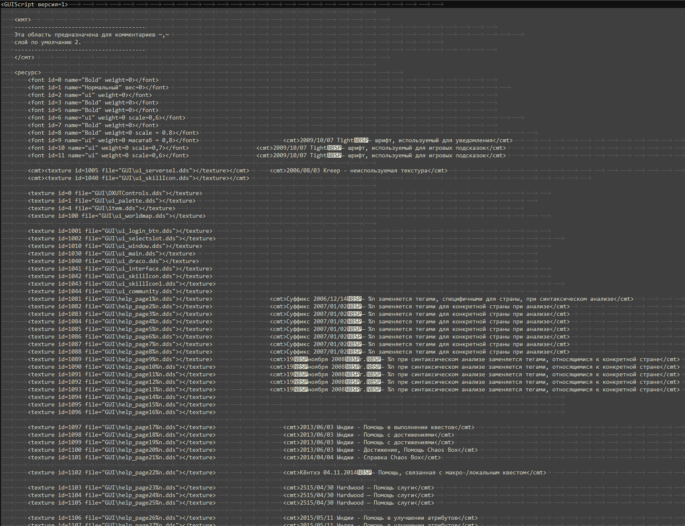

# ⚪️🔵🔴 Переведенный файл GUI.txt на русский



Перевел с корейкого на русский, что бы было проще что-либо найти.

``` Перевод GUI от клиента 1602 и корейских клиентов от 6.6.2023 года и 6.23.2023 года. ```

## Содержание:
- [Перевод gui от клиента 1602 (2019)](https://github.com/Aksel911/R2-Textures/tree/main/%5BGUI%5D%20RUSSIAN%20TRANSLATE/%5BGUI%5D%20от%20клиента%201602%20(2019))
- [Перевод gui от клиента KOREA OFF до 6.6.2023](https://github.com/Aksel911/R2-Textures/tree/main/%5BGUI%5D%20RUSSIAN%20TRANSLATE/%5BGUI%5D%20от%20клиента%20KOREA%20OFF%20до%206.6.2023)
- [Перевод gui от клиента KOREA OFF от 6.22.2023](https://github.com/Aksel911/R2-Textures/tree/main/%5BGUI%5D%20RUSSIAN%20TRANSLATE/%5BGUI%5D%20от%20клиента%20KOREA%20OFF%20от%206.22.2023)