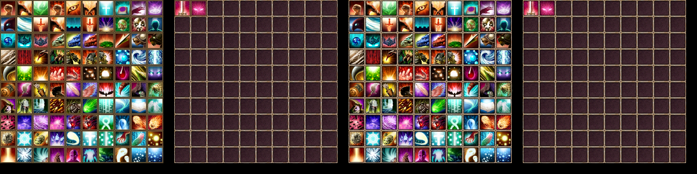

# Превью всех .dds файлов в папке
## Превью для collage_row_0.png:

- Использованные файлы:
- - ``` skill01.dds ```
- - ``` skill02.dds ```
- - ``` ui_skillicon.dds ```
- - ``` ui_skillIcon1.dds ```
