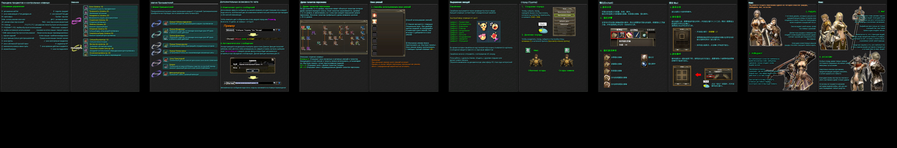
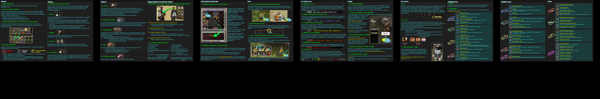
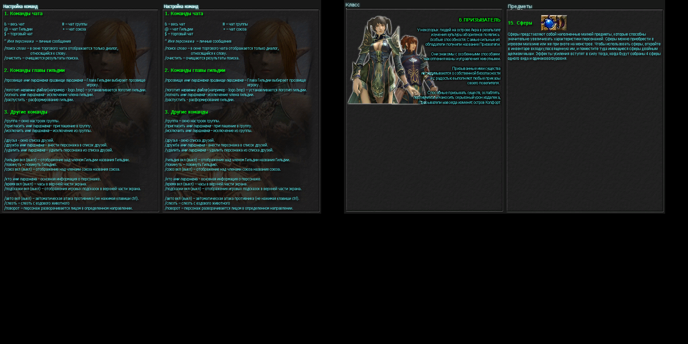

# Превью всех .dds файлов в папке
## Превью для collage_row_0.png:

- Использованные файлы:
- - ``` help_page10CN.dds ```
- - ``` help_page11CN.dds ```
- - ``` help_page12CN.dds ```
- - ``` help_page13CN.dds ```
- - ``` help_page14CN.dds ```
- - ``` help_page1CN.dds ```
## Превью для collage_row_1.png:

- Использованные файлы:
- - ``` help_page2CN.dds ```
- - ``` help_page3CN.dds ```
- - ``` help_page4CN.dds ```
- - ``` help_page5CN.dds ```
- - ``` help_page6CN.dds ```
- - ``` help_page7CN.dds ```
## Превью для collage_row_2.png:

- Использованные файлы:
- - ``` help_page8CN.dds ```
- - ``` help_page9CN.dds ```
