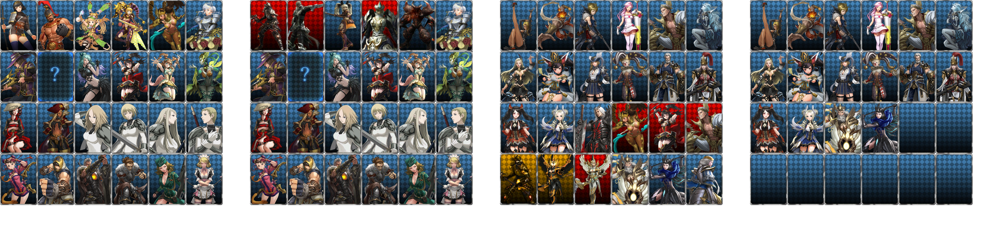

# Превью всех .dds файлов в папке
## Превью для collage_row_0.png:

- Использованные файлы:
- - ``` collection01.dds ```
- - ``` collection02.dds ```
- - ``` collection03.dds ```
- - ``` COLLECTION04.DDS ```
