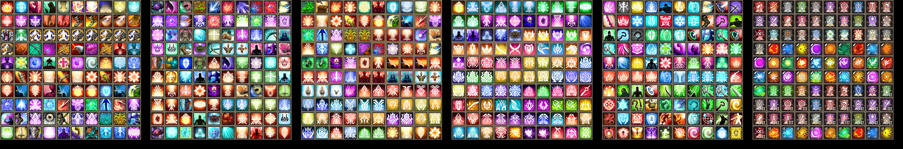
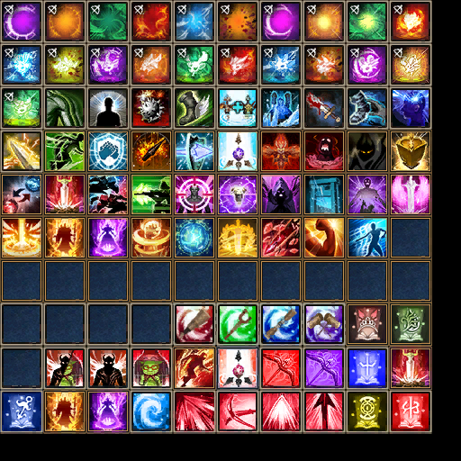

# Превью всех .dds файлов в папке
## Превью для collage_row_0.png:

- Использованные файлы:
- - ``` skillicon01.dds ```
- - ``` skillicon02.dds ```
- - ``` skillicon03.dds ```
- - ``` skillicon04.dds ```
- - ``` skillicon05.dds ```
- - ``` SKILLICON06.DDS ```
## Превью для collage_row_1.png:

- Использованные файлы:
- - ``` skillicon07.dds ```
