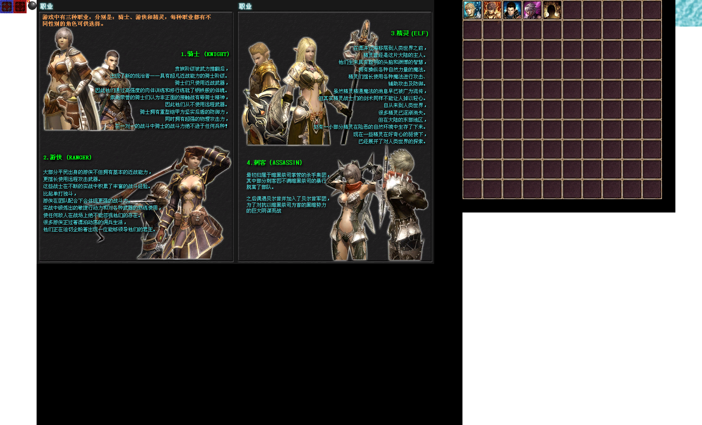
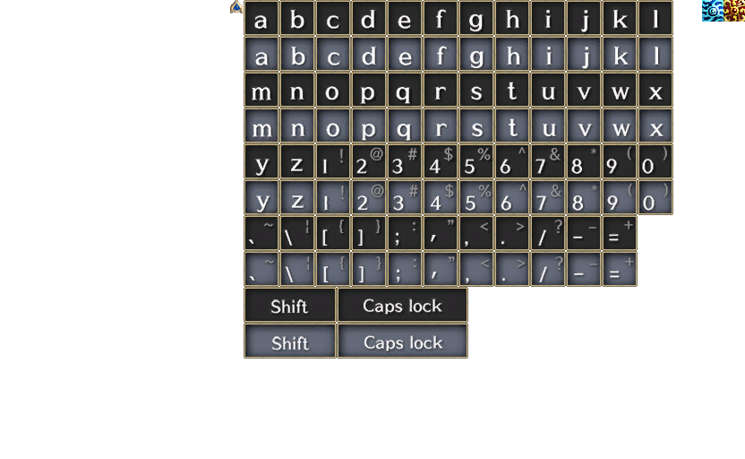

# Превью всех .dds файлов в папке
## Превью для collage_row_0.png:

- Использованные файлы:
- - ``` battle_blue.dds ```
- - ``` battle_red.dds ```
- - ``` boom.dds ```
- - ``` help_page1CN.dds ```
- - ``` master.dds ```
- - ``` ocean.dds ```
## Превью для collage_row_1.png:

- Использованные файлы:
- - ``` Pentagon.dds ```
- - ``` selecticon_arrow1.dds ```
- - ``` softkey.dds ```
- - ``` TeamRank_Ocean.dds ```
- - ``` TeamRank_Sun.dds ```
