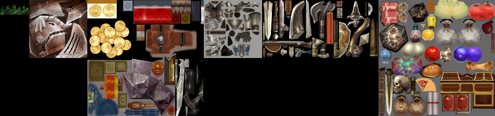

# Превью всех .dds файлов в папке
## Превью для collage_row_0.png:

- Использованные файлы:
- - ``` 1386.dds ```
- - ``` an_chest.dds ```
- - ``` archload_smoke_03.dds ```
- - ``` battlestone.dds ```
- - ``` blob.dds ```
- - ``` blood_a.dds ```
## Превью для collage_row_1.png:

- Использованные файлы:
- - ``` blur_light.dds ```
- - ``` blur_vertical02.dds ```
- - ``` Blur_vertical04.dds ```
- - ``` Blur_vertical_cylinder.dds ```
- - ``` Blur_vertical_rend.dds ```
- - ``` blur_vertical_wind.dds ```
## Превью для collage_row_2.png:

- Использованные файлы:
- - ``` Blur_vertical_wind2.dds ```
- - ``` breast-sacred_n.dds ```
- - ``` D1_darkcave_magma.dds ```
- - ``` D1_darkcave_magma03.dds ```
- - ``` D1_darkcave_magma04.dds ```
- - ``` D1_darkcave_magma2.dds ```
## Превью для collage_row_3.png:

- Использованные файлы:
- - ``` d1_darkcave_spiderline1.dds ```
- - ``` D1_darkcave_wall1.dds ```
- - ``` D1_darkcave_wall2.dds ```
- - ``` D1_darkcave_wallss2.dds ```
- - ``` damage_main.dds ```
- - ``` dirt_energ.dds ```
## Превью для collage_row_4.png:

- Использованные файлы:
- - ``` dirt_swamp.dds ```
- - ``` dragoon_helm.dds ```
- - ``` dropitem.dds ```
- - ``` dropitem01.dds ```
- - ``` dropitem02.dds ```
- - ``` dropitem03.dds ```
## Превью для collage_row_5.png:

- Использованные файлы:
- - ``` dust.dds ```
- - ``` dusta.dds ```
- - ``` dust_b.dds ```
- - ``` dust_fall.dds ```
- - ``` effect_01.dds ```
- - ``` effect_02.dds ```
## Превью для collage_row_6.png:

- Использованные файлы:
- - ``` effect_03.dds ```
- - ``` effect_04.dds ```
- - ``` elec_circle.dds ```
- - ``` Elec_light02.dds ```
- - ``` e_smoke1.dds ```
- - ``` e_smoke2.dds ```
## Превью для collage_row_7.png:

- Использованные файлы:
- - ``` e_smoke3.dds ```
- - ``` firea.dds ```
- - ``` fireb.dds ```
- - ``` firec.dds ```
- - ``` fired.dds ```
- - ``` firee.dds ```
## Превью для collage_row_8.png:

- Использованные файлы:
- - ``` firef.dds ```
- - ``` fireh.dds ```
- - ``` firei.dds ```
- - ``` fire_ball2.dds ```
- - ``` fire_ball3.dds ```
- - ``` Fire_Candle.dds ```
## Превью для collage_row_9.png:

- Использованные файлы:
- - ``` Fire_Soul.dds ```
- - ``` Glow_01.dds ```
- - ``` Glow_02.dds ```
- - ``` glow_03.dds ```
- - ``` glow_04.dds ```
- - ``` glow_05.dds ```
## Превью для collage_row_10.png:

- Использованные файлы:
- - ``` Glow_06.dds ```
- - ``` Glow_07.dds ```
- - ``` Glow_08.dds ```
- - ``` glow_dot.dds ```
- - ``` Glow_noncenter.dds ```
- - ``` glow_point02.dds ```
## Превью для collage_row_11.png:

- Использованные файлы:
- - ``` glow_point_r.dds ```
- - ``` Glow_point_R2.dds ```
- - ``` glow_point_w.dds ```
- - ``` Grayscale.dds ```
- - ``` item00004.dds ```
- - ``` item_add.dds ```
## Превью для collage_row_12.png:

- Использованные файлы:
- - ``` light01.dds ```
- - ``` loading_CN.dds ```
- - ``` loading_KR.dds ```
- - ``` nhngameslogo_cn.dds ```
- - ``` nhngameslogo_kr.dds ```
- - ``` nhngameslogo_ru.dds ```
## Превью для collage_row_13.png:

- Использованные файлы:
- - ``` noise_gloss.dds ```
- - ``` pumice.dds ```
- - ``` pumice04.dds ```
- - ``` R1_ef_FireTower_A10.dds ```
- - ``` r1_orccamp_pot.dds ```
- - ``` r1_skel.dds ```
## Превью для collage_row_14.png:

- Использованные файлы:
- - ``` R3_Sp5_Stone_effect.dds ```
- - ``` R3_Sp6_UnderWaterCave_crysta.dds ```
- - ``` rainbowlogo.dds ```
- - ``` ray03.dds ```
- - ``` ray04.dds ```
- - ``` ray05.dds ```
## Превью для collage_row_15.png:

- Использованные файлы:
- - ``` ray09.dds ```
- - ``` ray10.dds ```
- - ``` ray11.dds ```
- - ``` ray12.dds ```
- - ``` ray15.dds ```
- - ``` ray_circle.dds ```
## Превью для collage_row_16.png:

- Использованные файлы:
- - ``` ray_explo.dds ```
- - ``` ray_explo02.dds ```
- - ``` ray_explo03.dds ```
- - ``` ray_explo04.dds ```
- - ``` ray_five.dds ```
- - ``` ray_glow.dds ```
## Превью для collage_row_17.png:

- Использованные файлы:
- - ``` ray_groung.dds ```
- - ``` ray_groung2.dds ```
- - ``` ray_piece02.dds ```
- - ``` ray_piece03.dds ```
- - ``` ray_spark.dds ```
- - ``` ray_spark02.dds ```
## Превью для collage_row_18.png:

- Использованные файлы:
- - ``` ray_sparkle.dds ```
- - ``` ray_spark_blue.dds ```
- - ``` ray_streak.dds ```
- - ``` Ray_X.dds ```
- - ``` ringa.dds ```
- - ``` ring_blur.dds ```
## Превью для collage_row_19.png:

- Использованные файлы:
- - ``` ring_blur02.dds ```
- - ``` ring_blur06_orange.dds ```
- - ``` Ring_board_wind.dds ```
- - ``` Ring_cloud.dds ```
- - ``` ring_double.dds ```
- - ``` Ring_dust.dds ```
## Превью для collage_row_20.png:

- Использованные файлы:
- - ``` ring_glass.dds ```
- - ``` Ring_glass02.dds ```
- - ``` ring_glow.dds ```
- - ``` ring_glow02.dds ```
- - ``` ring_glow03.dds ```
- - ``` ring_grd.dds ```
## Превью для collage_row_21.png:

- Использованные файлы:
- - ``` ring_point.dds ```
- - ``` ring_rainbow.dds ```
- - ``` ruby.dds ```
- - ``` shape_bar.dds ```
- - ``` shape_bug.dds ```
- - ``` shape_chain.dds ```
## Превью для collage_row_22.png:

- Использованные файлы:
- - ``` shape_draco.dds ```
- - ``` shape_fireball.dds ```
- - ``` shape_ice.dds ```
- - ``` shape_land00.dds ```
- - ``` shape_land02.dds ```
- - ``` shape_land03.dds ```
## Превью для collage_row_23.png:

- Использованные файлы:
- - ``` shape_leaf.dds ```
- - ``` shape_pig.dds ```
- - ``` shape_Rune01.dds ```
- - ``` shape_rune02.dds ```
- - ``` shape_rune03.dds ```
- - ``` shape_rune05.dds ```
## Превью для collage_row_24.png:

- Использованные файлы:
- - ``` shape_rune06.dds ```
- - ``` shape_Rune10.dds ```
- - ``` shape_Rune11.dds ```
- - ``` shape_Rune14.dds ```
- - ``` shape_snow.dds ```
- - ``` shape_spider.dds ```
## Превью для collage_row_25.png:

- Использованные файлы:
- - ``` shape_spider02.dds ```
- - ``` shape_spider03.dds ```
- - ``` shape_spider04.dds ```
- - ``` shape_spider05.dds ```
- - ``` shape_spider06.dds ```
- - ``` shape_stone.dds ```
## Превью для collage_row_26.png:

- Использованные файлы:
- - ``` shape_zombie.dds ```
- - ``` smog_cloud02.dds ```
- - ``` smog_cloud03.dds ```
- - ``` smog_cloud04.dds ```
- - ``` smog_cloud05.dds ```
- - ``` smog_cloud07.dds ```
## Превью для collage_row_27.png:

- Использованные файлы:
- - ``` smog_cloud08.dds ```
- - ``` smog_cloud09.dds ```
- - ``` smog_cloud10.dds ```
- - ``` smog_cloud11.dds ```
- - ``` smog_cloud12.dds ```
- - ``` smog_cloud13.dds ```
## Превью для collage_row_28.png:

- Использованные файлы:
- - ``` smog_cloud14.dds ```
- - ``` smog_cloud15.dds ```
- - ``` smog_cloud17.dds ```
- - ``` Smog_Sprite04.dds ```
- - ``` Smog_Sprite05.dds ```
- - ``` Smog_Sprite06.dds ```
## Превью для collage_row_29.png:

- Использованные файлы:
- - ``` Smog_Sprite07.dds ```
- - ``` smoke_spr02.dds ```
- - ``` smoke_spr03.dds ```
- - ``` smoke_spr04.dds ```
- - ``` spark1.dds ```
- - ``` spark2.dds ```
## Превью для collage_row_30.png:

- Использованные файлы:
- - ``` spider01.dds ```
- - ``` spider02.dds ```
- - ``` spider06.dds ```
- - ``` spider07.dds ```
- - ``` spiderline.dds ```
- - ``` stone.dds ```
## Превью для collage_row_31.png:

- Использованные файлы:
- - ``` title_back_CN.dds ```
- - ``` title_back_KR.dds ```
- - ``` Title_chrselect.dds ```
- - ``` title_effect.dds ```
- - ``` title_line.dds ```
- - ``` title_loading.dds ```
## Превью для collage_row_32.png:

- Использованные файлы:
- - ``` Title_logo_R2_blur.dds ```
- - ``` title_newr2.dds ```
- - ``` title_r2.dds ```
- - ``` title_serverback.dds ```
- - ``` Title_serversel.dds ```
- - ``` title_serverwindow.dds ```
## Превью для collage_row_33.png:

- Использованные файлы:
- - ``` title_text.dds ```
- - ``` trail.dds ```
- - ``` trail_areal.dds ```
- - ``` trail_linear.dds ```
- - ``` ui_loading.dds ```
- - ``` vampire queen_blood.dds ```
## Превью для collage_row_34.png:

- Использованные файлы:
- - ``` water_bubble.dds ```
- - ``` water_bubble02.dds ```
- - ``` water_drop.dds ```
- - ``` water_fall_02.dds ```
- - ``` water_fall_smpke.dds ```
- - ``` water_Fall_smpke02.dds ```
## Превью для collage_row_35.png:

- Использованные файлы:
- - ``` water_Fall_smpke_blue.dds ```
- - ``` water_fall_tile.dds ```
- - ``` water_vertical.dds ```
- - ``` water_vertical2.dds ```
- - ``` water_wave.dds ```
- - ``` water_wave03.dds ```
## Превью для collage_row_36.png:

- Использованные файлы:
- - ``` wave_gra_01.dds ```
