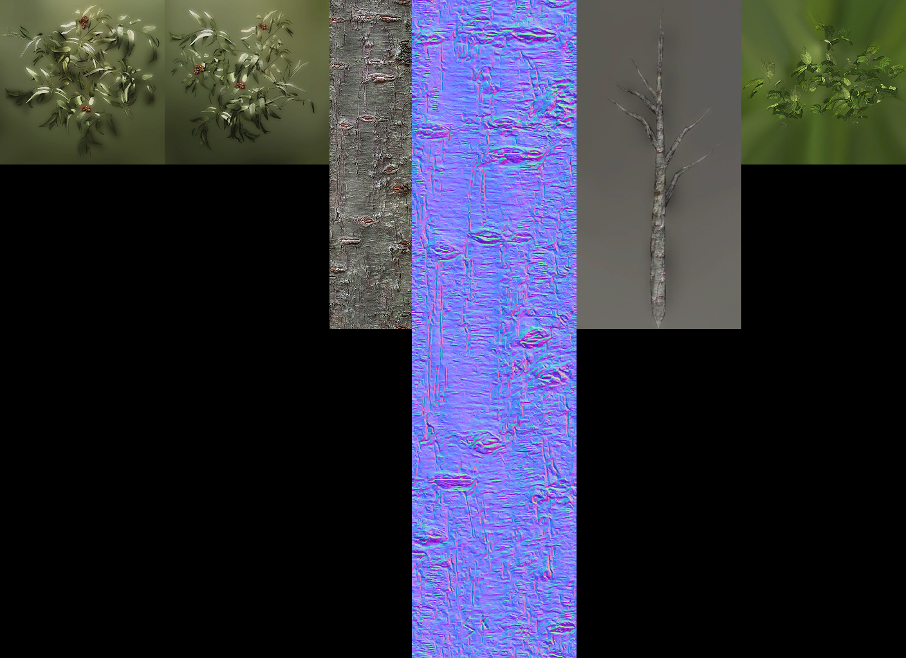
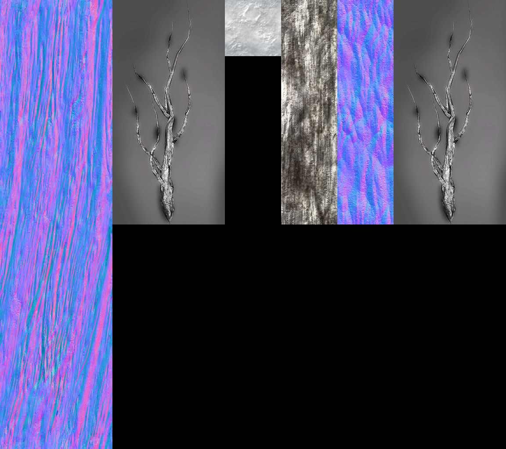

# Превью всех .dds файлов в папке
## Превью для collage_row_0.png:

- Использованные файлы:
- - ``` agarwoodbark.dds ```
- - ``` agarwoodbark_normal.dds ```
- - ``` agarwoodfrond.dds ```
- - ``` agarwoodleaves_rt_1.dds ```
- - ``` agarwoodleaves_rt_2.dds ```
- - ``` austrianpinebark.dds ```
## Превью для collage_row_1.png:

- Использованные файлы:
- - ``` austrianpinebark_normal.dds ```
- - ``` austrianpinefrond.dds ```
- - ``` austrianpineneedles_rt_1.dds ```
- - ``` austrianpineneedles_rt_2.dds ```
- - ``` bambooclum.dds ```
- - ``` bambooclum_normal.dds ```
## Превью для collage_row_2.png:

- Использованные файлы:
- - ``` banyantreebarkvines_normal.dds ```
- - ``` banyantreeleaves_and_vines.dds ```
- - ``` baobab_frond.dds ```
- - ``` baobab_leaves_1.dds ```
- - ``` baobab_leaves_2.dds ```
- - ``` baobab_wrap.dds ```
## Превью для collage_row_3.png:

- Использованные файлы:
- - ``` BarkWrap.dds ```
- - ``` beechbark.dds ```
- - ``` beechbark_normal.dds ```
- - ``` beechfrond.dds ```
- - ``` beechleaves_rt_1.dds ```
- - ``` beechleaves_rt_2.dds ```
## Превью для collage_row_4.png:

- Использованные файлы:
- - ``` BigScaryTreeLeaves_1.dds ```
- - ``` BigScaryTreeLeaves_2.dds ```
- - ``` blackland01_compositemap_diffuse.dds ```
- - ``` blackland01_compositemap_diffuse_billboards.dds ```
- - ``` blackland01_compositemap_normal_billboards.dds ```
- - ``` blackland01_compositemap_self-shadows.dds ```
## Превью для collage_row_5.png:

- Использованные файлы:
- - ``` blackland02_compositemap_diffuse.dds ```
- - ``` blackland02_compositemap_diffuse_billboards.dds ```
- - ``` blackland02_compositemap_normal_billboards.dds ```
- - ``` blackland02_compositemap_self-shadows.dds ```
- - ``` blackland_compositemap_diffuse.dds ```
- - ``` blackland_compositemap_diffuse_billboards.dds ```
## Превью для collage_row_6.png:

- Использованные файлы:
- - ``` blackland_compositemap_normal_billboards.dds ```
- - ``` blackland_compositemap_self-shadows.dds ```
- - ``` bluesprucebark.dds ```
- - ``` bluesprucebark_normal.dds ```
- - ``` bluesprucefrond.dds ```
- - ``` bluespruceneedles_1.dds ```
## Превью для collage_row_7.png:

- Использованные файлы:
- - ``` bluespruceneedles_2.dds ```
- - ``` bradfordpearbark.dds ```
- - ``` bradfordpearbark_normal.dds ```
- - ``` bradfordpearfrond.dds ```
- - ``` bradfordpearleaves_md_1.dds ```
- - ``` bradfordpearleaves_md_2.dds ```
## Превью для collage_row_8.png:

- Использованные файлы:
- - ``` broadleafbark.dds ```
- - ``` broadleafbark_normal.dds ```
- - ``` broadleaffrond.dds ```
- - ``` broadleafleaves1.dds ```
- - ``` broadleafleaves2.dds ```
- - ``` byron01_compositemap_diffuse.dds ```
## Превью для collage_row_9.png:

- Использованные файлы:
- - ``` byron01_compositemap_diffuse_billboards.dds ```
- - ``` byron01_compositemap_normal_billboards.dds ```
- - ``` byron01_compositemap_self-shadows.dds ```
- - ``` byron02_compositemap_diffuse.dds ```
- - ``` byron02_compositemap_diffuse_billboards.dds ```
- - ``` byron02_compositemap_normal_billboards.dds ```
## Превью для collage_row_10.png:

- Использованные файлы:
- - ``` byron02_compositemap_self-shadows.dds ```
- - ``` byron_compositemap_diffuse.dds ```
- - ``` byron_compositemap_diffuse_billboards.dds ```
- - ``` byron_compositemap_normal_billboards.dds ```
- - ``` byron_compositemap_self-shadows.dds ```
- - ``` californiabuckeyebark.dds ```
## Превью для collage_row_11.png:

- Использованные файлы:
- - ``` californiabuckeyebark_normal.dds ```
- - ``` californiabuckeyefrondbranches.dds ```
- - ``` californiabuckeyeleaves_rt_1.dds ```
- - ``` californiabuckeyeleaves_rt_2.dds ```
- - ``` carolinabuckthornbark.dds ```
- - ``` carolinabuckthornbark_normal.dds ```
## Превью для collage_row_12.png:

- Использованные файлы:
- - ``` carolinabuckthornleaves_1.dds ```
- - ``` carolinabuckthornleaves_2.dds ```
- - ``` clippedfrond.dds ```
- - ``` clippedfrondwrap.dds ```
- - ``` coconut.dds ```
- - ``` coconutpalmbark.dds ```
## Превью для collage_row_13.png:

- Использованные файлы:
- - ``` coconutpalmbark_normal.dds ```
- - ``` coconutpalmfrond.dds ```
- - ``` commonoliveleaves_md_1.dds ```
- - ``` curlypalmbark.dds ```
- - ``` curlypalmbark_normal.dds ```
- - ``` curlypalmfrond.dds ```
## Превью для collage_row_14.png:

- Использованные файлы:
- - ``` datepalmbark.dds ```
- - ``` datepalmbark_normal.dds ```
- - ``` datepalmfrond.dds ```
- - ``` deadfronds.dds ```
- - ``` douglasfirbark.dds ```
- - ``` douglasfirbark_norma.dds ```
## Превью для collage_row_15.png:

- Использованные файлы:
- - ``` douglasfirfrond.dds ```
- - ``` douglasfirneedles_rt_1.dds ```
- - ``` douglasfirneedles_rt_2.dds ```
- - ``` easternredcedarbark.dds ```
- - ``` easternredcedarbark_normal.dds ```
- - ``` easternredcedarfrond.dds ```
## Превью для collage_row_16.png:

- Использованные файлы:
- - ``` easternredcedarneedles_1.dds ```
- - ``` easternredcedarneedles_2.dds ```
- - ``` elephantearfrond.dds ```
- - ``` elephantearleaf.dds ```
- - ``` elephantearskin.dds ```
- - ``` elephantearskin_normal.dds ```
## Превью для collage_row_17.png:

- Использованные файлы:
- - ``` elephantskinwrap.dds ```
- - ``` englishoakbark.dds ```
- - ``` englishoakbark_normal.dds ```
- - ``` englishoakleaves_md_1.dds ```
- - ``` englishoakleaves_md_2.dds ```
- - ``` europeanaspenbark.dds ```
## Превью для collage_row_18.png:

- Использованные файлы:
- - ``` europeanaspenbark_normal.dds ```
- - ``` europeanaspenleaves_md_1.dds ```
- - ``` europeanaspenleaves_md_2.dds ```
- - ``` FanPalmBark.dds ```
- - ``` FanPalmFrond.dds ```
- - ``` furie_compositemap_diffuse.dds ```
## Превью для collage_row_19.png:

- Использованные файлы:
- - ``` furie_compositemap_diffuse_billboards.dds ```
- - ``` furie_compositemap_normal_billboards.dds ```
- - ``` furie_compositemap_self-shadows.dds ```
- - ``` giantredwoodbark.dds ```
- - ``` giantredwoodbark_normal.dds ```
- - ``` giantredwoodfrond.dds ```
## Превью для collage_row_20.png:

- Использованные файлы:
- - ``` giantredwoodleaves_1.dds ```
- - ``` giantredwoodleaves_2.dds ```
- - ``` giantredwood_dirtbase.dds ```
- - ``` gimletbark.dds ```
- - ``` gimletbark_normal.dds ```
- - ``` gimletfrond.dds ```
## Превью для collage_row_21.png:

- Использованные файлы:
- - ``` gimletleaves_1.dds ```
- - ``` gimletleaves_2.dds ```
- - ``` grannysmithapplebark.dds ```
- - ``` grannysmithapplebark_normal.dds ```
- - ``` grannysmithapplefrond.dds ```
- - ``` grannysmithappleleaves_1.dds ```
## Превью для collage_row_22.png:

- Использованные файлы:
- - ``` grannysmithappleleaves_2.dds ```
- - ``` graybirchbark.dds ```
- - ``` graybirchbark_normal.dds ```
- - ``` graybirchfrond.dds ```
- - ``` graybirchleaves_md_1.dds ```
- - ``` graybirchleaves_md_2.dds ```
## Превью для collage_row_23.png:

- Использованные файлы:
- - ``` greenashbark.dds ```
- - ``` greenashbark_normal.dds ```
- - ``` greenashfrond.dds ```
- - ``` greenashleaves_md_1.dds ```
- - ``` greenashleaves_md_2.dds ```
- - ``` greypoplarbark.dds ```
## Превью для collage_row_24.png:

- Использованные файлы:
- - ``` greypoplarbark_normal.dds ```
- - ``` greypoplarfrond.dds ```
- - ``` greypoplarleaves_md_1.dds ```
- - ``` greypoplarleaves_md_2.dds ```
- - ``` halloweenoakbark.dds ```
- - ``` halloweenoakbark_normal.dds ```
## Превью для collage_row_25.png:

- Использованные файлы:
- - ``` halloweenoakfrond.dds ```
- - ``` horsechestnutbark.dds ```
- - ``` horsechestnutbark_normal.dds ```
- - ``` horsechestnutfrond.dds ```
- - ``` horsechestnutleaves_1.dds ```
- - ``` horsechestnutleaves_2.dds ```
## Превью для collage_row_26.png:

- Использованные файлы:
- - ``` italiancypressbark.dds ```
- - ``` italiancypressbark_normal.dds ```
- - ``` italiancypressfrond.dds ```
- - ``` italiancypressneedles_md_1.dds ```
- - ``` italiancypressneedles_md_2.dds ```
- - ``` italianstonepinebark.dds ```
## Превью для collage_row_27.png:

- Использованные файлы:
- - ``` italianstonepinebark_normal.dds ```
- - ``` italianstonepinedleaves_2.dds ```
- - ``` italianstonepinefrond.dds ```
- - ``` italianstonepineleaves_1.dds ```
- - ``` japanesemaplebark.dds ```
- - ``` japanesemaplebark_normal.dds ```
## Превью для collage_row_28.png:

- Использованные файлы:
- - ``` japanesemaplefrond.dds ```
- - ``` japanesemapleleaves_1.dds ```
- - ``` japanesemapleleaves_2.dds ```
- - ``` joshuatreebark.dds ```
- - ``` joshuatreebark_normal.dds ```
- - ``` joshuatreefrondbranches.dds ```
## Превью для collage_row_29.png:

- Использованные файлы:
- - ``` joshuatreeleaves_md_1.dds ```
- - ``` joshuatreeleaves_md_2.dds ```
- - ``` junglebrushbase_normal.dds ```
- - ``` JungleBrushLeaves.dds ```
- - ``` LilyPad_01.dds ```
- - ``` liveoakbark.dds ```
## Превью для collage_row_30.png:

- Использованные файлы:
- - ``` liveoakbark_normal.dds ```
- - ``` liveoakfrondbranches.dds ```
- - ``` liveoakleaves_rt_1.dds ```
- - ``` liveoakleaves_rt_2 .dds ```
- - ``` lombardypoplarbark.dds ```
- - ``` lombardypoplarbark_normal.dds ```
## Превью для collage_row_31.png:

- Использованные файлы:
- - ``` lombardypoplarfrond.dds ```
- - ``` lombardypoplarleaves_md_1.dds ```
- - ``` lombardypoplarleaves_md_2.dds ```
- - ``` londonplanebark.dds ```
- - ``` londonplanebark_normal.dds ```
- - ``` londonplanefrond.dds ```
## Превью для collage_row_32.png:

- Использованные файлы:
- - ``` londonplaneleaves_md_1.dds ```
- - ``` londonplaneleaves_md_2.dds ```
- - ``` metheus_-CompositeMap_diffuse.dds ```
- - ``` metheus_-CompositeMap_diffuse_billboards.dds ```
- - ``` metheus_-CompositeMap_normal_billboards.dds ```
- - ``` metheus_-CompositeMap_self-shadows.dds ```
## Превью для collage_row_33.png:

- Использованные файлы:
- - ``` mockernuthickorybark.dds ```
- - ``` mockernuthickorybark_normal.dds ```
- - ``` mockernuthickoryfrond.dds ```
- - ``` mockernuthickoryleaves_1.dds ```
- - ``` mockernuthickoryleaves_2.dds ```
- - ``` montereycypressbark.dds ```
## Превью для collage_row_34.png:

- Использованные файлы:
- - ``` montereycypressbark_normal.dds ```
- - ``` montereycypressfrond.dds ```
- - ``` montereycypressneedles_md_1.dds ```
- - ``` montereycypressneedles_md_2.dds ```
- - ``` mosswrap.dds ```
- - ``` MushroomSkin.dds ```
## Превью для collage_row_35.png:

- Использованные файлы:
- - ``` palmettobark.dds ```
- - ``` palmettobark_normal.dds ```
- - ``` palmettoleaf_1.dds ```
- - ``` palmettoleaf_2.dds ```
- - ``` palmettospikes.dds ```
- - ``` palm_compositemap_diffuse.dds ```
## Превью для collage_row_36.png:

- Использованные файлы:
- - ``` palm_compositemap_diffuse_billboards.dds ```
- - ``` palm_compositemap_normal_billboards.dds ```
- - ``` PampasGrassFlower.dds ```
- - ``` pawpawbark.dds ```
- - ``` pawpawbark_normal.dds ```
- - ``` pawpawfrondbranches.dds ```
## Превью для collage_row_37.png:

- Использованные файлы:
- - ``` pawpawleaves_1.dds ```
- - ``` pawpawleaves_2.dds ```
- - ``` PinOakBark.dds ```
- - ``` PinOakBark_Normal.dds ```
- - ``` pinoakfrond.dds ```
- - ``` pinoakleaves_md_1.dds ```
## Превью для collage_row_38.png:

- Использованные файлы:
- - ``` pinoakleaves_md_2.dds ```
- - ``` PurpleSeaUrchinSkin.dds ```
- - ``` queenpalmbark.dds ```
- - ``` queenpalmbark_normal.dds ```
- - ``` queenpalmflowers.dds ```
- - ``` queenpalmfrond.dds ```
## Превью для collage_row_39.png:

- Использованные файлы:
- - ``` redmaplebark.dds ```
- - ``` redmaplebark_normal.dds ```
- - ``` redmaplefrond.dds ```
- - ``` redmapleleaves_md_1.dds ```
- - ``` redmapleleaves_md_2.dds ```
- - ``` riverbirchbark.dds ```
## Превью для collage_row_40.png:

- Использованные файлы:
- - ``` riverbirchbark_normal.dds ```
- - ``` riverbirchfrond.dds ```
- - ``` riverbirchleaves_rt_1.dds ```
- - ``` riverbirchleaves_rt_2.dds ```
- - ``` rodendg1_compositemap_diffuse.dds ```
- - ``` rodendg1_compositemap_diffuse_billboards.dds ```
## Превью для collage_row_41.png:

- Использованные файлы:
- - ``` rodendg1_compositemap_normal_billboards.dds ```
- - ``` rodendg1_compositemap_self-shadows.dds ```
- - ``` rodendg1_snow_01_bark.dds ```
- - ``` rodendg1_snow_01_barknormal.dds ```
- - ``` rodendg1_snow_01_frond.dds ```
- - ``` rodendg1_snow_01_needles_1.dds ```
## Превью для collage_row_42.png:

- Использованные файлы:
- - ``` rodendg1_snow_01_needles_2.dds ```
- - ``` rodendg1_snow_01_wrap.dds ```
- - ``` rodendg1_snow_02_bark.dds ```
- - ``` rodendg1_snow_02_bark_normal.dds ```
- - ``` rodendg1_snow_02_frond.dds ```
- - ``` rodendg1_snow_03_bark.dds ```
## Превью для collage_row_43.png:

- Использованные файлы:
- - ``` rodendg1_snow_03_bark_normal.dds ```
- - ``` rodendg1_snow_03_frond.dds ```
- - ``` rodendg1_snow_03_needles_1.dds ```
- - ``` rodendg1_snow_03_needles_2.dds ```
- - ``` rodendg1_snow_03_wrap.dds ```
- - ``` rodendg1_snow_04_bark.dds ```
## Превью для collage_row_44.png:

- Использованные файлы:
- - ``` rodendg1_snow_04_bark_normal.dds ```
- - ``` rodendg1_snow_04_frond.dds ```
- - ``` rodendg1_snow_04_wrap.dds ```
- - ``` rodendg1_snow_05_bark.dds ```
- - ``` rodendg1_snow_05_bark_norma.dds ```
- - ``` rodendg1_snow_05_frond.dds ```
## Превью для collage_row_45.png:

- Использованные файлы:
- - ``` rodendg1_snow_05_needles_1.dds ```
- - ``` rodendg1_snow_05_needles_2.dds ```
- - ``` rodendg1_snow_05_wrap.dds ```
- - ``` rodendg1_snow_06_bark.dds ```
- - ``` rodendg1_snow_06_bark_normal.dds ```
- - ``` rodendg1_snow_06_frond.dds ```
## Превью для collage_row_46.png:

- Использованные файлы:
- - ``` rodendg1_snow_06_needles_1.dds ```
- - ``` rodendg1_snow_06_needles_2.dds ```
- - ``` rodendg1_snow_06_wrap.dds ```
- - ``` rodendg1_snow_compositemap_diffuse.dds ```
- - ``` rodendg1_snow_compositemap_diffuse_billboards.dds ```
- - ``` rodendg1_snow_compositemap_normal_billboards.dds ```
## Превью для collage_row_47.png:

- Использованные файлы:
- - ``` rodendg1_snow_compositemap_self-shadows.dds ```
- - ``` roden_compositemap_diffuse.dds ```
- - ``` roden_compositemap_diffuse_billboards.dds ```
- - ``` roden_compositemap_normal_billboards.dds ```
- - ``` roden_compositemap_self-shadows.dds ```
- - ``` roden_ex_compositemap_diffuse.dds ```
## Превью для collage_row_48.png:

- Использованные файлы:
- - ``` roden_ex_compositemap_diffuse_billboards.dds ```
- - ``` roden_ex_compositemap_normal_billboards.dds ```
- - ``` roden_ex_compositemap_self-shadows.dds ```
- - ``` roden_olivebark.dds ```
- - ``` roden_olivebark_normal.dds ```
- - ``` roden_olivefrondbranches.dds ```
## Превью для collage_row_49.png:

- Использованные файлы:
- - ``` RussianOliveLeaves_Summer_1.dds ```
- - ``` saguarocactus_skin.dds ```
- - ``` saguarocactus_skin_normal.dds ```
- - ``` saguarorottingskin.dds ```
- - ``` shingleoakbark.dds ```
- - ``` shingleoakbark_normal.dds ```
## Превью для collage_row_50.png:

- Использованные файлы:
- - ``` shingleoakfrond.dds ```
- - ``` shingleoakleaves_1.dds ```
- - ``` shingleoakleaves_2.dds ```
- - ``` spidertreebark.dds ```
- - ``` spidertreebark_normal.dds ```
- - ``` spidertreeleaves_1.dds ```
## Превью для collage_row_51.png:

- Использованные файлы:
- - ``` spidertreeleaves_2.dds ```
- - ``` sugarpinebark.dds ```
- - ``` sugarpinebark_normal.dds ```
- - ``` sugarpinefrond.dds ```
- - ``` sugarpineneedles_1.dds ```
- - ``` sugarpineneedles_2.dds ```
## Превью для collage_row_52.png:

- Использованные файлы:
- - ``` sycamorebark.dds ```
- - ``` sycamorebark_normal.dds ```
- - ``` sycamorefrondbranch.dds ```
- - ``` sycamoreleaves_md_1.dds ```
- - ``` sycamoreleaves_md_2.dds ```
- - ``` tulippoplarbark.dds ```
## Превью для collage_row_53.png:

- Использованные файлы:
- - ``` tulippoplarbark_normal.dds ```
- - ``` tulippoplarfrond.dds ```
- - ``` tulippoplarleaves_1.dds ```
- - ``` tulippoplarleaves_2.dds ```
- - ``` umbrellathornbark.dds ```
- - ``` umbrellathornbark_normal.dds ```
## Превью для collage_row_54.png:

- Использованные файлы:
- - ``` umbrellathornfrondbranches.dds ```
- - ``` umbrellathornleaves_md_1.dds ```
- - ``` umbrellathornleaves_md_2.dds ```
- - ``` vivaxfrond.dds ```
- - ``` vivaxleaves_1.dds ```
- - ``` vivaxleaves_2.dds ```
## Превью для collage_row_55.png:

- Использованные файлы:
- - ``` WeepingWillowLeaves_2.dds ```
- - ``` westernredcedarbark.dds ```
- - ``` westernredcedarbark_normal.dds ```
- - ``` westernredcedarfrond.dds ```
- - ``` westernredcedarneedles_1.dds ```
- - ``` westernredcedarneedles_2.dds ```
## Превью для collage_row_56.png:

- Использованные файлы:
- - ``` whitemosswrap.dds ```
- - ``` whiteoakbark.dds ```
- - ``` whiteoakbark_normal.dds ```
- - ``` whiteoakfrond.dds ```
- - ``` whiteoakleaves_md_1.dds ```
- - ``` whiteoakleaves_md_2.dds ```
## Превью для collage_row_57.png:

- Использованные файлы:
- - ``` zaratantree_bark_01.dds ```
- - ``` zaratantree_bark_01_normal.dds ```
- - ``` zaratantree_frond.dds ```
- - ``` zaratantree_leaves_01.dds ```
- - ``` zaratantree_leaves_02.dds ```
- - ``` zaratantree_wrap.dds ```
