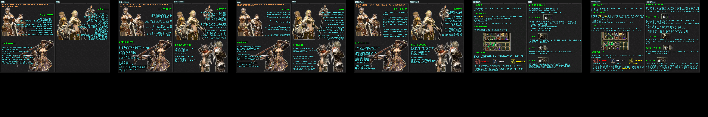
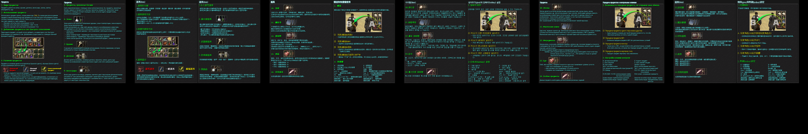
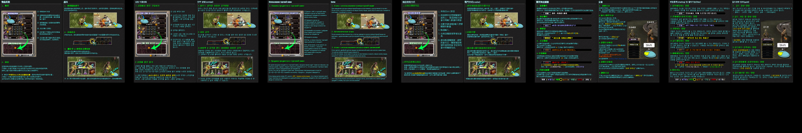
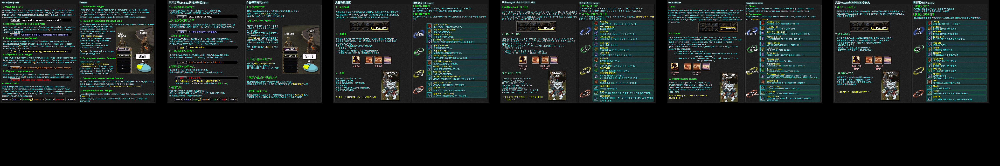
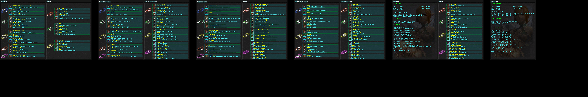
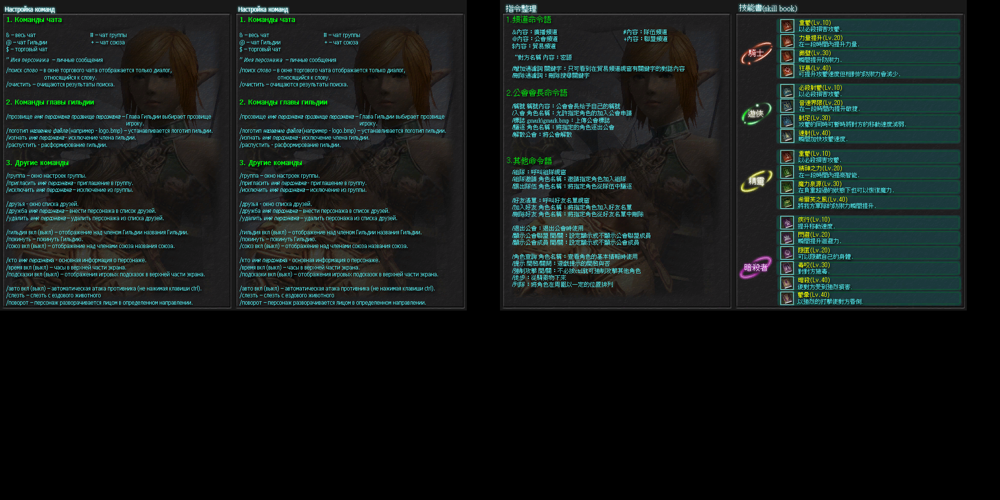

# Превью всех .dds файлов в папке
## Превью для collage_row_0.png:

- Использованные файлы:
- - ``` help_page1CN.dds ```
- - ``` help_page1KR.dds ```
- - ``` help_page1RU.dds ```
- - ``` help_page1TW.dds ```
- - ``` help_page2CN.dds ```
- - ``` help_page2KR.dds ```
## Превью для collage_row_1.png:

- Использованные файлы:
- - ``` help_page2RU.dds ```
- - ``` help_page2TW.dds ```
- - ``` help_page3CN.dds ```
- - ``` help_page3KR.dds ```
- - ``` help_page3RU.dds ```
- - ``` help_page3TW.dds ```
## Превью для collage_row_2.png:

- Использованные файлы:
- - ``` help_page4CN.dds ```
- - ``` help_page4KR.dds ```
- - ``` help_page4RU.dds ```
- - ``` help_page4TW.dds ```
- - ``` help_page5CN.dds ```
- - ``` help_page5KR.dds ```
## Превью для collage_row_3.png:

- Использованные файлы:
- - ``` help_page5RU.dds ```
- - ``` help_page5TW.dds ```
- - ``` help_page6CN.dds ```
- - ``` help_page6KR.dds ```
- - ``` help_page6RU.dds ```
- - ``` help_page6TW.dds ```
## Превью для collage_row_4.png:

- Использованные файлы:
- - ``` help_page7CN.dds ```
- - ``` help_page7KR.dds ```
- - ``` help_page7RU.dds ```
- - ``` help_page7TW.dds ```
- - ``` help_page8CN.dds ```
- - ``` help_page8KR.dds ```
## Превью для collage_row_5.png:

- Использованные файлы:
- - ``` help_page8RU.dds ```
- - ``` help_page8TW.dds ```
