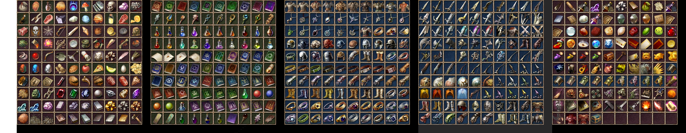
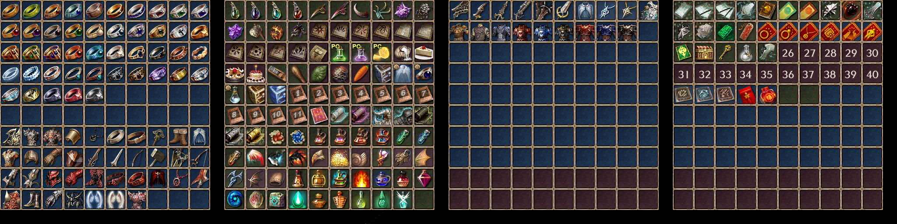

# Превью всех .dds файлов в папке
## Превью для collage_row_0.png:

- Использованные файлы:
- - ``` item.dds ```
- - ``` item01.dds ```
- - ``` item02.dds ```
- - ``` item03.dds ```
- - ``` item04.dds ```
- - ``` item05.dds ```
## Превью для collage_row_1.png:

- Использованные файлы:
- - ``` item06.dds ```
- - ``` item07.dds ```
- - ``` item08.dds ```
- - ``` item09.dds ```
