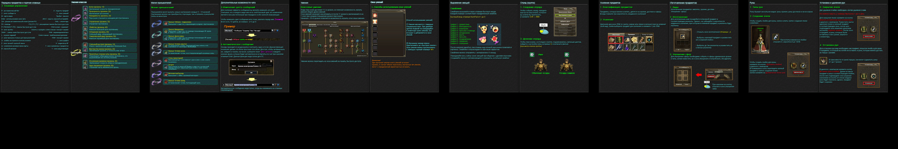
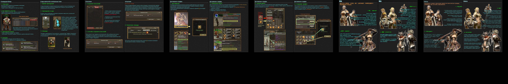
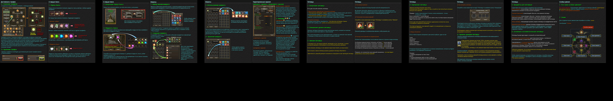
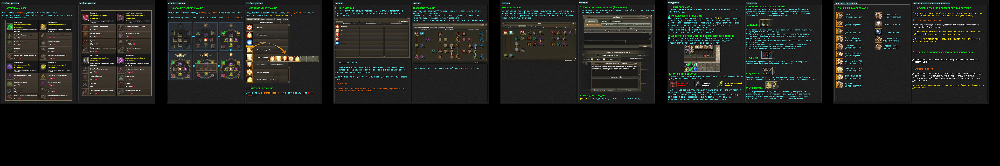
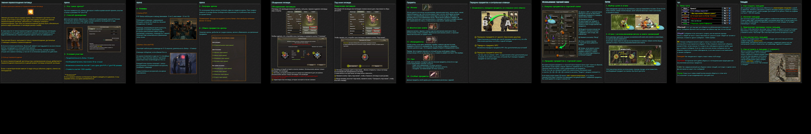

# Превью всех .dds файлов в папке
## Превью для collage_row_0.png:

- Использованные файлы:
- - ``` help_page10RU.dds ```
- - ``` help_page11RU.dds ```
- - ``` help_page12RU.dds ```
- - ``` help_page13RU.dds ```
- - ``` help_page14RU.dds ```
- - ``` help_page15RU.dds ```
## Превью для collage_row_1.png:

- Использованные файлы:
- - ``` help_page16RU.dds ```
- - ``` help_page17RU.dds ```
- - ``` help_page18RU.dds ```
- - ``` help_page19RU.dds ```
- - ``` help_page1CN.dds ```
- - ``` help_page1RU.dds ```
## Превью для collage_row_2.png:

- Использованные файлы:
- - ``` help_page20RU.dds ```
- - ``` help_page21RU.dds ```
- - ``` help_page22RU.dds ```
- - ``` help_page23RU.dds ```
- - ``` help_page24RU.dds ```
- - ``` help_page25RU.dds ```
## Превью для collage_row_3.png:

- Использованные файлы:
- - ``` help_page26RU.dds ```
- - ``` help_page27RU.dds ```
- - ``` help_page28RU.dds ```
- - ``` help_page29RU.dds ```
- - ``` help_page2RU.dds ```
- - ``` help_page30RU.dds ```
## Превью для collage_row_4.png:

- Использованные файлы:
- - ``` help_page31RU.dds ```
- - ``` help_page32RU.dds ```
- - ``` help_page33RU.dds ```
- - ``` help_page3RU.dds ```
- - ``` help_page4RU.dds ```
- - ``` help_page5RU.dds ```
## Превью для collage_row_5.png:

- Использованные файлы:
- - ``` help_page6RU.dds ```
- - ``` help_page7RU.dds ```
- - ``` help_page8RU.dds ```
- - ``` help_page9RU.dds ```
