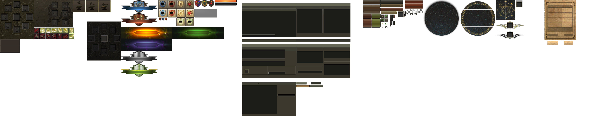
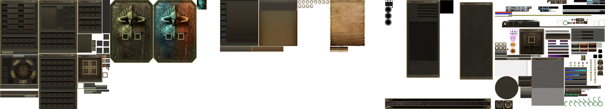
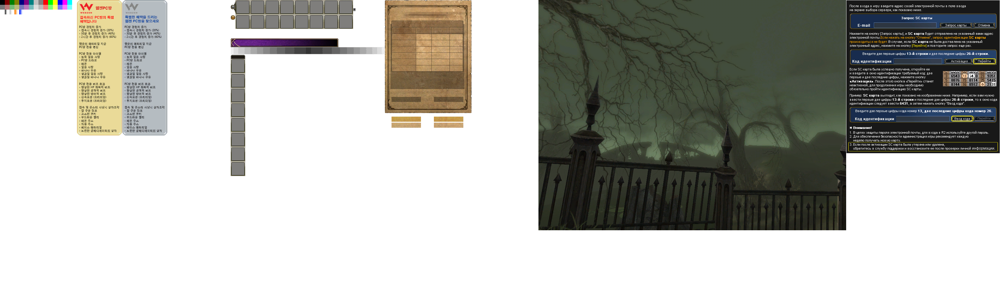
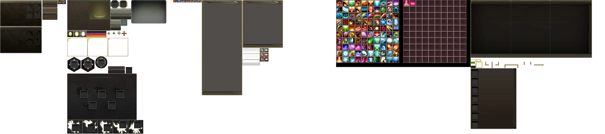
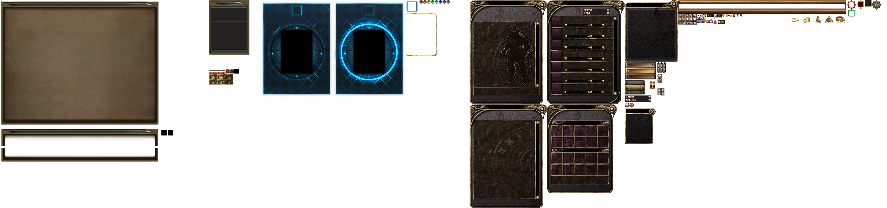

# Превью всех .dds файлов в папке
## Превью для collage_row_0.png:

- Использованные файлы:
- - ``` ui_achievement.dds ```
- - ``` ui_arena.dds ```
- - ``` ui_community.dds ```
- - ``` ui_consignment.dds ```
- - ``` ui_enhancement_skill.dds ```
- - ``` ui_gamble.dds ```
## Превью для collage_row_1.png:

- Использованные файлы:
- - ``` ui_interface.dds ```
- - ``` ui_ItemIncrease.dds ```
- - ``` ui_itemshop.dds ```
- - ``` ui_letter.dds ```
- - ``` ui_login_btn.dds ```
- - ``` ui_main.dds ```
## Превью для collage_row_2.png:

- Использованные файлы:
- - ``` ui_palette.dds ```
- - ``` ui_pcroom.dds ```
- - ``` ui_quickslot.dds ```
- - ``` ui_racing.dds ```
- - ``` ui_sc_bg.dds ```
- - ``` ui_sc_guideRU.dds ```
## Превью для collage_row_3.png:

- Использованные файлы:
- - ``` ui_selectslot.dds ```
- - ``` ui_servant.dds ```
- - ``` ui_serversel.dds ```
- - ``` ui_skillicon.dds ```
- - ``` ui_skillIcon1.dds ```
- - ``` ui_skilltree.dds ```
## Превью для collage_row_4.png:

- Использованные файлы:
- - ``` ui_storyboard.dds ```
- - ``` ui_summon.dds ```
- - ``` ui_transform_skill_reinforcement.dds ```
- - ``` ui_window.dds ```
- - ``` ui_worldmap.dds ```
