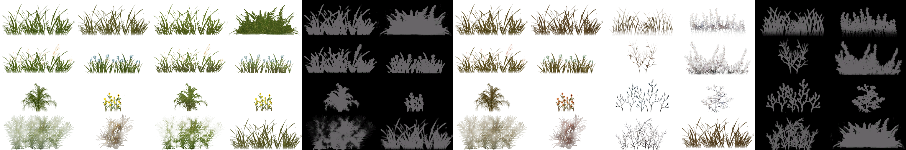
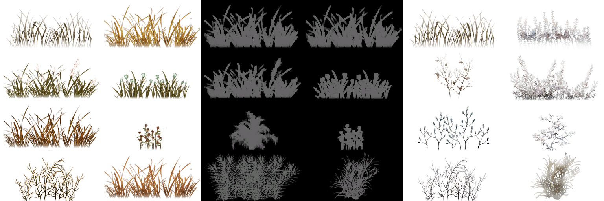

# Превью всех ***.dds*** файлов в папке: Default
## Превью для collage_row_0.png:

- Использованные файлы:
- - ``` Grass.DDS ```
- - ``` grass1.dds ```
- - ``` Grass1Mask.dds ```
- - ``` grass2.dds ```
- - ``` Grass3.dds ```
- - ``` Grass3Mask.dds ```
## Превью для collage_row_1.png:

- Использованные файлы:
- - ``` Grass4.dds ```
- - ``` grassMask.dds ```
- - ``` Grass_snow.dds ```
