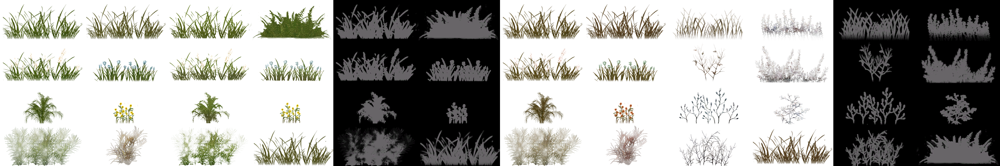
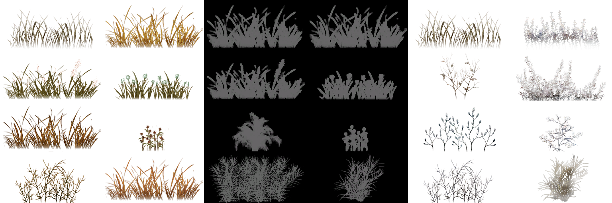
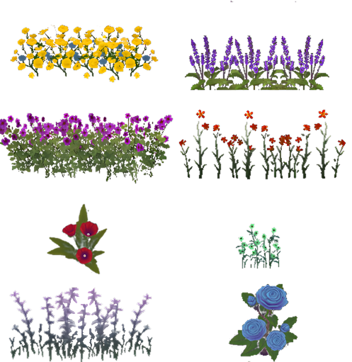
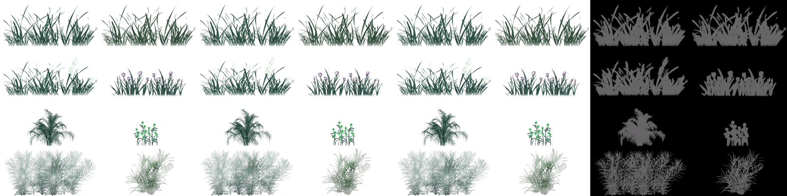

# Различные текстуры травы

# Превью всех ***.dds*** файлов в папке: [Default](Default)
## Превью для collage_row_0.png:

- Использованные файлы:
- - ``` Grass.DDS ```
- - ``` grass1.dds ```
- - ``` Grass1Mask.dds ```
- - ``` grass2.dds ```
- - ``` Grass3.dds ```
- - ``` Grass3Mask.dds ```
## Превью для collage_row_1.png:

- Использованные файлы:
- - ``` Grass4.dds ```
- - ``` grassMask.dds ```
- - ``` Grass_snow.dds ```


# Превью всех ***.dds*** файлов в папке: [Flower](Flower)
## Превью для collage_row_0.png:

- Использованные файлы:
- - ``` Grass.DDS ```


# Превью всех ***.dds*** файлов в папке: [Winter](Winter)
## Превью для collage_row_0.png:

- Использованные файлы:
- - ``` Grass.DDS ```
- - ``` grass1.DDS ```
- - ``` grass2.DDS ```
- - ``` grassMask.dds ```
